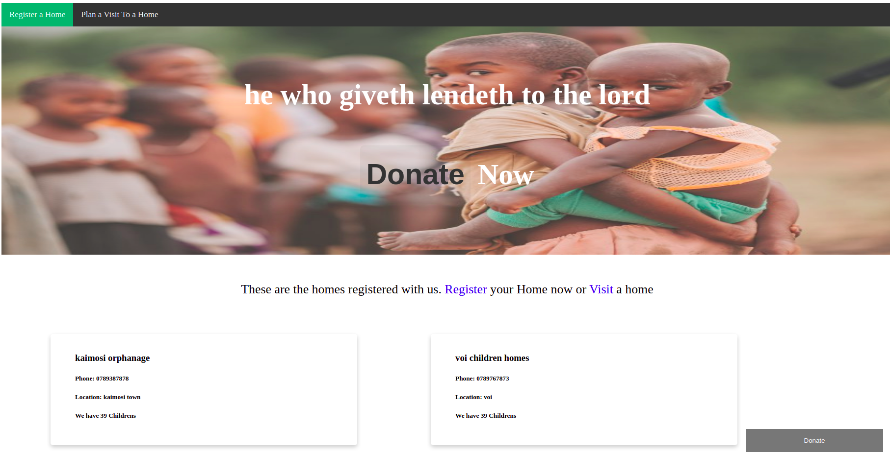
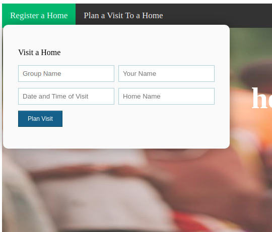

# Frontend for my PortFolio project (OFAN)

This site consumes endpoints built from [this repo](https://github.com/kiminzajnr/PortfolioProject--BackEnd) and aims to enable individuals to easily extend help to Orphans and Children Homes through contributions and visits.

#### Tech/ Framework

> JavaScript, HTML, CSS (No framework used)

---

#### Key features

> - Donate (payment not yet integrated)

---

> - Register a Home

> adds a home to the database

---

> - Plan a Visit

> enable individual book a visit date and home to visit
 "plan a visit")

> - List Homes

> Displays all Registered Homes
